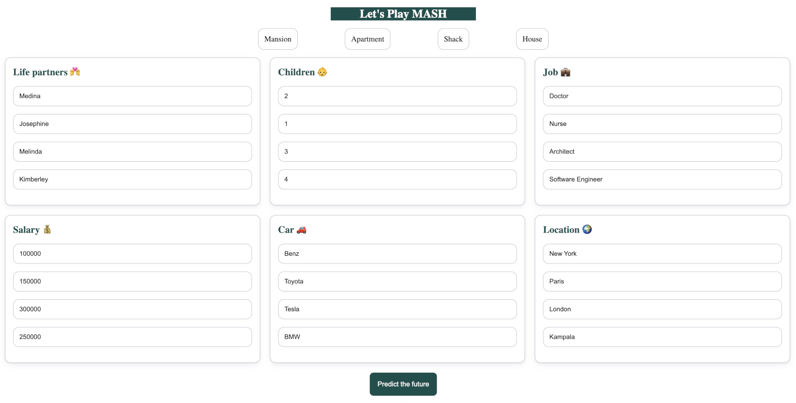
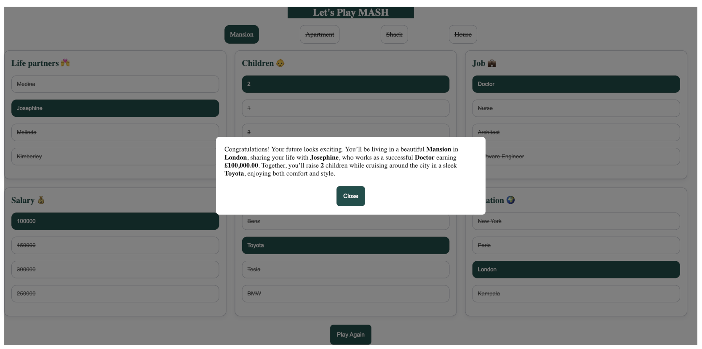
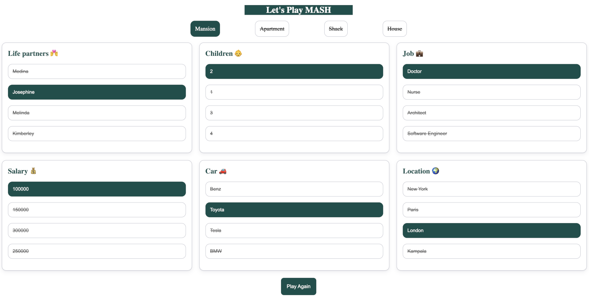

# Let's Play MASH

Let’s Play MASH is a lightweight, browser‑based remake of the classic children’s fortune‑telling game. 
Enter your choices, hit **Predict the future**, and watch the app generate a silly future using a simple, kid‑friendly algorithm. 
Built with Vue.js — ideal for beginners, educators, or anyone who loves nostalgic web games.

---
## Development

- Vue.js
- Vite
- SASS (SCSS)
---

## Screenshots

Preview of the app in action, showing the form and the generated future results.

- Form with data
  

- Game result with predicted future
  

- Game result with selected and crossed out options
  

---

## Features

- Add 4 options for each category: Life Partners,Salary, Children, Car, Job, Location
- Fully client‑side — no backend required
- Easy to fork, remix, or embed in other projects

---

## Future improvements

- Simplify algorithm
- Make categories and options configurable for the user through an interactive UI
- AI integration
